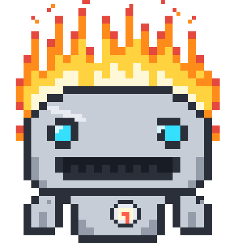
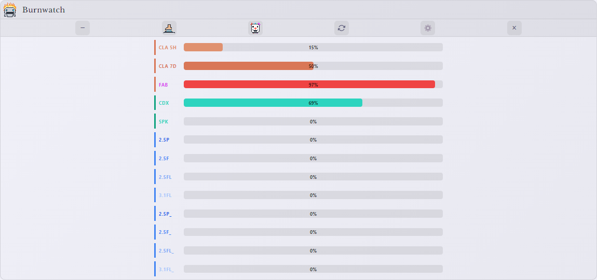
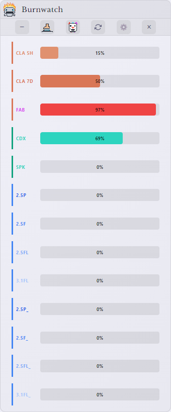
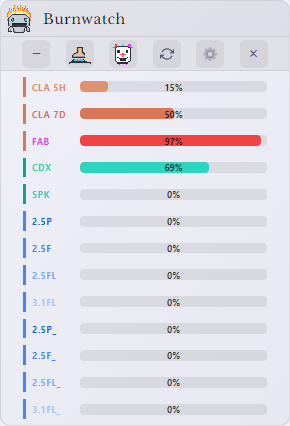

<p align="center">
  
</p>

<h1 align="center">Burnwatch</h1>

**Burnwatch** — a standalone desktop widget for **Windows, macOS, and Linux** tracking your AI usage across **Anthropic, OpenAI, and Google** in real-time. *Some tokens just want to watch the world learn.*


---

## The headline: every account on your machine, tracked

Power users end up logged into the **desktop app and the CLI with different accounts** — claude.ai in the browser but another account in the `claude` CLI, ChatGPT desktop plus a second account in `codex`, a Google login here and a different one in `gemini`. Every one of those accounts has its **own limits**, and most trackers only see one of them.

Burnwatch tracks **both accounts per company, simultaneously**:

- 🔑 **Sign in with ChatGPT / Google** (official OAuth), or let Burnwatch read your **CLI logins** — no extra setup
- 🧬 **Same account everywhere?** The views merge automatically — no duplicate rows
- 🟠 **Different accounts?** An amber **CLI: 2ND ACCT** pill appears and the second account gets its own rows, history series, burn-spike alerts, and tray badge (marked with a terminal-cursor `61▁`)
- 🖥️ In **wide mode** the two accounts sit **side by side** — one shared model column, a Desktop cluster and a CLI cluster, each under its own labels
- 🖥️ **No web login? No problem.** If you're signed into the `claude` CLI but not claude.ai, Burnwatch can run the whole Anthropic section straight off that CLI login ("via CLI login") — and if a CLI token is stale, OpenAI usage still shows from the local session-log snapshot.
- 🔥 Not interested? **Burn the pill away** — pixel fire chars it (Soot & Sparks finish, smoke included) and the rows roll up until you burn it back



---

## Every pool, all three companies

Each provider meters more than one thing — Burnwatch shows **all of it**:

- **Anthropic** — Claude Session (5h), All Claude Models (7d), **Fable (7d)** plus per-model/surface weekly pools when your account has them (Sonnet, Opus, Cowork, Design, OAuth Apps) and any future model-scoped limit (all rendered generically from the API), Extra Usage spend, and prepaid Account Credits
- **OpenAI** — Codex (7d), the separate **GPT-5.3-Codex-Spark** pool, Code Review (when your account has one), purchased credits, and banked **limit-reset orbs**
- **Google** — one row per model **version** (2.5 Pro, 2.5 Flash, 2.5 Flash Lite, 3.1 Flash Lite…), because Google meters each separately, in progressive shades of Google blue

Don't care about a pool? **Hover it and click the minus** — hidden trackers collapse everywhere (including compact mode) and come back from the *N hidden* chip.


---

## A layout for every window

Burnwatch **reflows in realtime** as you drag — no fixed layouts, no clipped text:

- 📏 **Live resize ladder** — full labels → abbreviated windows ("2.5 Pro (1D)", tooltip explains) → colour-coded chips (`CLA 5H · CDX · SPK · 2.5P`) → countdown text becomes **remaining-time pies** → redundant columns bow out — down to a 200px sliver
- 🖼️ **Orientation aware** — wider than tall? The three companies line up as **columns** with per-column headers and a shared bottom line above the chart. Stretched tall? Text and the company wordmarks **grow to fill the space**
- 🗜️ **Compact mode** (the boot-stomping-a-can button) — one slim bar per pool across all companies, grouped by company colour, fits any corner
- 🪟 **Windows Snap** works natively — drag to an edge or Win+Arrow
- ↕️ The window **grows and contracts with its content**: toggle the graph, burn a group away, hide a tracker — the frame follows
- 🙈 **Your board, your rules** — collapse any company entirely from its header, hide any single model or pool from a hover, burn away whole account groups; everything restores with a click

<p align="center">
  
  
</p>

---

## Make it yours

- 🎨 **Themes** — Dark, Light, or follow the System, plus a custom widget **font colour**
- 🖌️ **Tray badge colours** — per-company background + number colours, all editable in Settings
- 🚨 **Critical outline** — badges gain a coloured border the moment a provider's API flags a limit as critical
- ⏱️ **Refresh interval** — 15s / 30s / 1m / 2m / 5m (default 5m); the countdowns keep ticking live in between
- 📌 **Window behaviour** — launch at startup, always-on-top, hide-from-taskbar, remembered position — all in-app toggles
- 🧯 **Thresholds** — set your own warn/danger percentages that recolour every bar

---

## Watching the burn

⏳ **Burn-rate Forecast** — projects when each pool hits 100%, on the chart and in tooltips
🗓️ **Session Planner** — per-company: finds your heaviest hours and suggests when to start a fresh window
🔔 **Usage & Burn-spike Alerts** — company-attributed desktop notifications; median+MAD anomaly detection on every tracked series (second accounts included)
📱 **Phone Alerts** — ntfy/webhook push for spikes, danger levels, maxed pools, daily digest
🌅 **Daily Digest** — yesterday's burn, per company, each morning
📈 **The Prediction Graph** — a 7-day history chart with **dotted burn-rate projections** showing when each pool will hit 100%. Toggled by the resident **pixel psychic**: eyes-open idle means history only; click him into his eyes-closed trance and the projections appear. Roomiest in wide mode, where it stretches beneath all three columns
💾 **Tray badges** — per-company colours (Anthropic blue, Fable red, OpenAI green, Google yellow), customizable, with X-on-red at 99%, terminal-cursor badges for second accounts, and an optional critical-severity outline
🔄 **Silent auto-update** — new releases download in the background and apply on next launch; you install Burnwatch exactly once

---

## The fun parts

🔥 **Pixel fire** — hiding an account group sends a pixel flame across its heading, charring the letters sooty-black with sparks and lingering smoke; reversing heals it letter by letter
✨ **Reset sparkles** — when a limit window completes, its ring gets a wand-tap burst (owed and paid later if you weren't looking)
🧊 **On ice** — companies you haven't touched in days freeze over, icicles and all
🟢 **Magic orbs** — banked OpenAI limit-resets glimmer softly
🤡 **The clown** — click him and he goes to jail, sad and crying, and every animation, glow, and filter in the app goes still. For the resource-conscious and the joyless alike.


---

## Installation

> 🔄 **Install once, update never again.** Burnwatch keeps itself current: it checks for new releases on launch (and daily), downloads them **silently in the background**, and applies them the next time the app starts. No more hunting down an installer for every release — the widget you install today is every future version too. (Portable and Linux builds show an update banner with a one-click link instead.)

### Download Pre-built Release

**Windows:**
1. Download the latest `Claude-Usage-Widget-{version}-win-Setup.exe` (installer) or `Claude-Usage-Widget-{version}-win-portable.exe` (no install needed) from [Releases](../../releases)
2. Run the installer or portable exe
3. Launch "Claude Usage Widget" from the Start Menu (installer) or directly (portable)
4. **To launch at Windows startup (portable only):** Press `Win+R`, type `shell:startup`, and copy the portable `.exe` into that folder. To update, copy the new version in and delete the old one.

**macOS & Linux:**

> Prebuilt macOS and Linux binaries aren't published yet — build from source (it's quick):
> ```bash
> git clone https://github.com/dev-newb/burnwatch.git
> cd burnwatch
> npm install
> npm run build:mac     # or: npm run build:linux
> ```
> The macOS `.dmg` / Linux `.AppImage` land in `dist/`. macOS builds are **not** signed or notarized, so Gatekeeper may warn "damaged or can't be opened" — clear the quarantine flag once:
> ```
> xattr -cr "/Applications/Claude Usage Widget.app"
> ```
> Or just run it in dev mode with `npm start`. (Prebuilt macOS/Linux binaries are on the roadmap.)

#### Linux: Desktop Launcher & Autostart (optional, after building)

> Build the AppImage first (see macOS & Linux above). On Ubuntu 22.04+ you may need `sudo apt install libfuse2` to run it.

By default the AppImage runs from wherever you put it. To get a clickable icon in your app launcher (and optionally launch at login), follow these steps.

**1. Place the AppImage somewhere permanent:**
```bash
mkdir -p ~/.local/bin
mv Claude-Usage-Widget-*.AppImage ~/.local/bin/claude-usage-widget.AppImage
chmod +x ~/.local/bin/claude-usage-widget.AppImage
```

**2. Create a desktop entry:**
```bash
cat > ~/.local/share/applications/claude-usage-widget.desktop << EOF
[Desktop Entry]
Name=Burnwatch
Comment=Track AI usage across Anthropic, OpenAI and Google
Exec=$HOME/.local/bin/claude-usage-widget.AppImage --no-sandbox
Icon=$HOME/.local/bin/claude-usage-widget.AppImage
Terminal=false
Type=Application
Categories=Utility;
StartupNotify=true
EOF
```

> **Note:** The `--no-sandbox` flag is required for Electron-based AppImages on most Linux systems due to sandbox namespace restrictions. This is an Electron/Chrome limitation, not specific to this widget.

**3. Register the entry:**
```bash
update-desktop-database ~/.local/share/applications/
```

The widget should now appear in your application launcher. Test it by launching from your app menu before proceeding to autostart.

**4. Autostart at login (optional):**
```bash
mkdir -p ~/.config/autostart
cp ~/.local/share/applications/claude-usage-widget.desktop ~/.config/autostart/
```

---

### Build from Source

**Prerequisites:**
- Node.js 18+ ([Download](https://nodejs.org))
- npm (comes with Node.js)

```bash
git clone https://github.com/dev-newb/burnwatch.git
cd burnwatch
npm install
npm start
```


---

## Usage

### First Launch

1. Launch the widget
2. Sign in to **Claude.ai** when prompted — a browser window opens, you log in, and Burnwatch captures the session automatically. The Anthropic section fills in immediately.
3. **OpenAI & Google are optional and automatic:** if you have the `codex` or `gemini` CLI logged in locally, those sections appear on their own. To connect a dedicated account, open **Settings (⚙️) → Sign in with ChatGPT / Sign in with Google**.
4. Already live in the `claude` CLI but not on the web? Burnwatch can run the Anthropic section straight off your CLI login ("via CLI login") with no browser step.

### Widget Controls

- **Drag** — Click and drag the title bar to move the widget
- **Refresh** — Click the refresh icon to update data immediately
- **Graph** — Click the graph icon to toggle usage history
- **Minimize** — Click the minus icon to hide to system tray / dock
- **Close** — Click the X to Close the app

### System Tray

Right-click the tray icon for: Show/Hide, Refresh, Re-login, Settings, Exit.

---

## Understanding the Display

Every pool is a row with the same four columns:

| Column | Description |
|--------|-------------|
| Session Used | Progress bar, 0–100% of that pool's limit |
| Elapsed | Circular timer — how far through the window you are (fills toward green, because a reset is good news) |
| Resets In | Countdown until the window resets |
| Resets At | The local clock time / date of the reset |

Bars wear each company's colour by default (Anthropic clay, Fable fuchsia, OpenAI green, Google blue). They turn **amber** above your warning threshold (default 75%) and **red** above the danger threshold (default 90%). Elapsed rings and, at narrow widths, the remaining-time pies use the same warm-to-green scale.

Prefer a different look? Settings has **Dark / Light / System themes** and a custom widget **font colour**, plus a configurable **auto-refresh interval** (15s–5min, default 5min; the countdowns tick continuously in between).

---

## Privacy & Security

- **Your logins stay on your machine.** The claude.ai session key and any OpenAI/Google OAuth tokens are stored locally and encrypted with the OS keychain (`safeStorage`). Burnwatch never uploads them.
- **It talks only to each provider's own API, using your own credentials** — `claude.ai` / `api.anthropic.com` (Anthropic), `chatgpt.com` (OpenAI Codex), `cloudcode-pa.googleapis.com` + `oauth2.googleapis.com` (Google Gemini) — plus `api.github.com` to check for its own updates. Nothing about your usage is sent anywhere else.
- **The one exception is opt-in:** if *you* turn on Phone Alerts and enter an ntfy/webhook URL, Burnwatch POSTs alert text (e.g. "Weekly at 92%") to that URL you chose. Leave it off and no usage data ever leaves the machine.
- **Read-only with your CLIs.** When reading local `claude`/`codex`/`gemini` CLI logins, Burnwatch only uses short-lived access tokens and never writes back to those files or rotates their refresh tokens.
- **Logout** clears the session key, cookies, and Electron session storage.

---

## Troubleshooting

**"Login Required" keeps appearing** — Your claude.ai session may have expired. Sign in again from the login screen (or Settings → Log Out then back in). OpenAI/Google sections are independent — they keep working from their own logins.

**Widget not updating** — Check internet connection, click refresh manually, or try re-logging in from the tray menu.

**Build errors** — Clean reinstall resolves most issues:
```bash
rm -rf node_modules package-lock.json
npm install
```

If issues persist, open a [Support discussion](../../discussions/categories/support) with your OS, Node.js version, and full error output.

---

## Roadmap

**Shipped in 2.0**
- [x] Multi-account tracking (desktop app + CLI, per company)
- [x] Every pool across Anthropic, OpenAI and Google
- [x] Realtime responsive reflow + orientation-aware layouts (portrait / landscape columns / tall / compact)
- [x] Native Windows Snap
- [x] Per-company tray badges + second-account badges
- [x] Burn-rate forecast, session planner, burn-spike + threshold alerts, daily digest, phone/webhook alerts
- [x] Silent background auto-update
- [x] Hide any pool, collapse any company, burn away account groups
- [x] Dark / Light / System themes + full customization

**Planned**
- [ ] Prebuilt macOS & Linux binaries (build-from-source works today)
- [ ] "Headroom right now" — a chip naming the provider with the most capacity for your next big job
- [ ] Burn-rate forecasts extended to OpenAI & Google pools
- [ ] One-click usage-history export (CSV/JSON)
- [ ] Keyboard shortcuts

---

## Credits

Burnwatch is a fork of the original **[Claude Usage Widget](https://github.com/SlavomirDurej/claude-usage-widget)** by **[Slavomir Durej](https://github.com/SlavomirDurej)** — the foundation this multi-provider version is built on. Thanks also to the upstream contributors ([@cwil2072](https://github.com/cwil2072), [@dion-jy](https://github.com/dion-jy), [@goooseman](https://github.com/goooseman), [@sergkuzn](https://github.com/sergkuzn)) whose work (macOS fixes, the usage graph, login-flow and security improvements, Linux packaging docs) carried forward into Burnwatch.

---

## License

This project is licensed under the [MIT License](LICENSE) - see the LICENSE file for details.

---

*Built with Electron · [Releases](../../releases) · [Discussions](../../discussions)*
