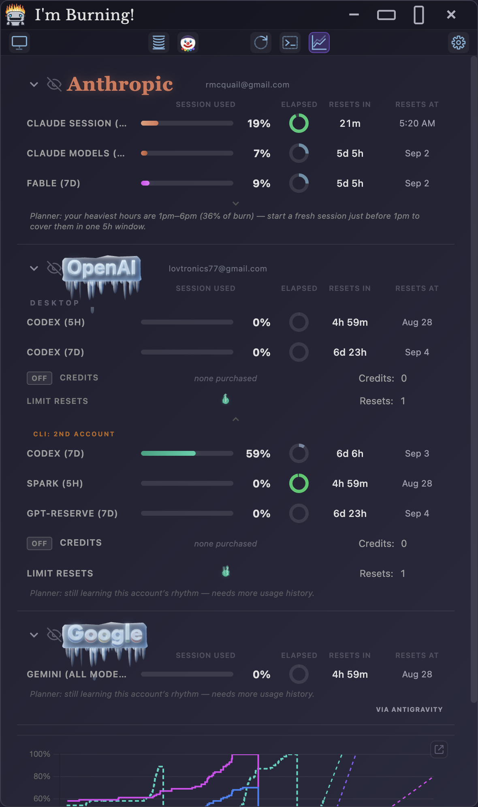
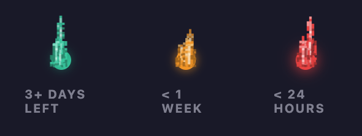
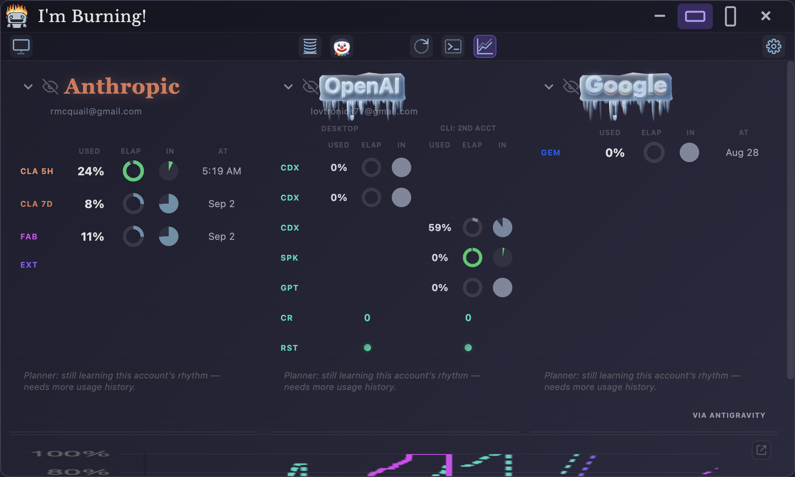
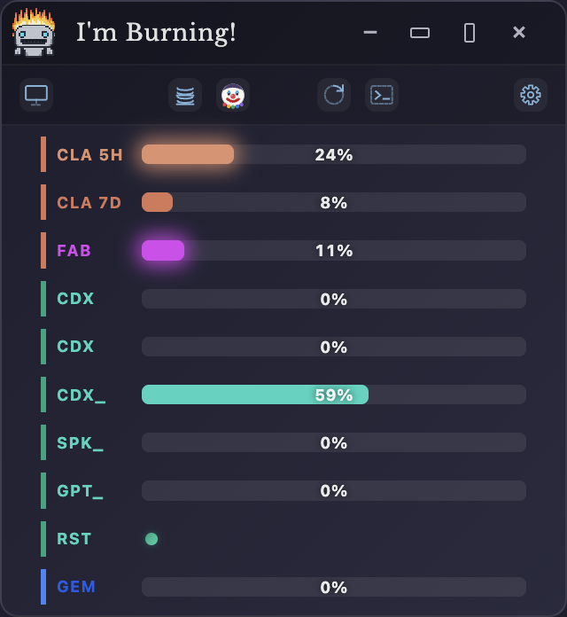
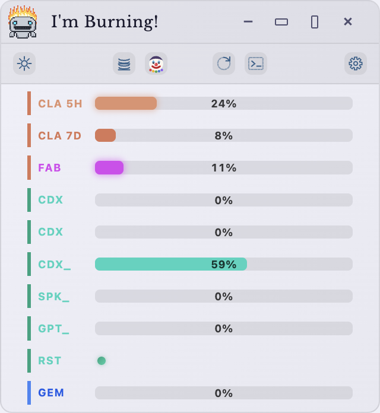
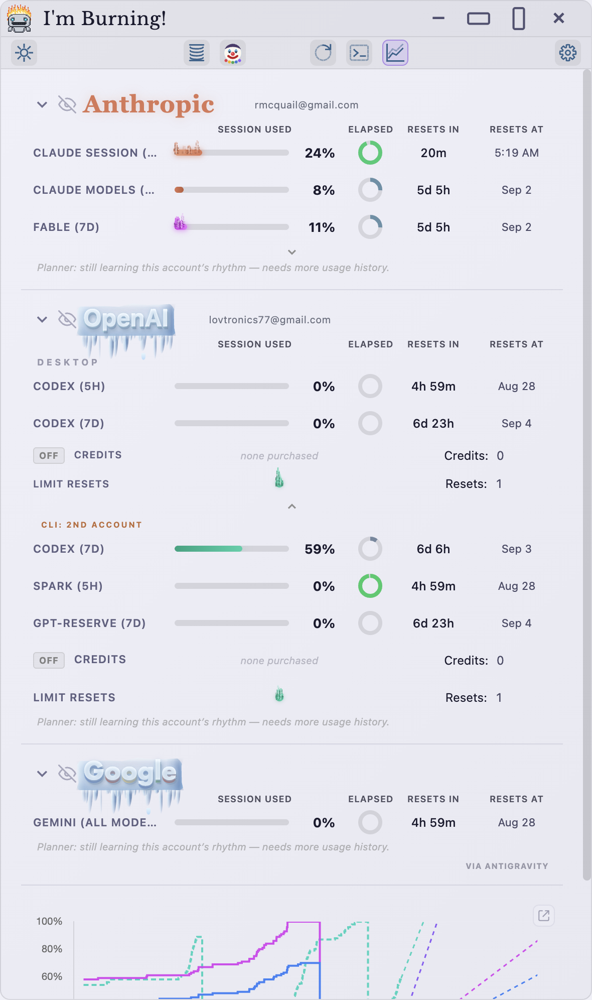
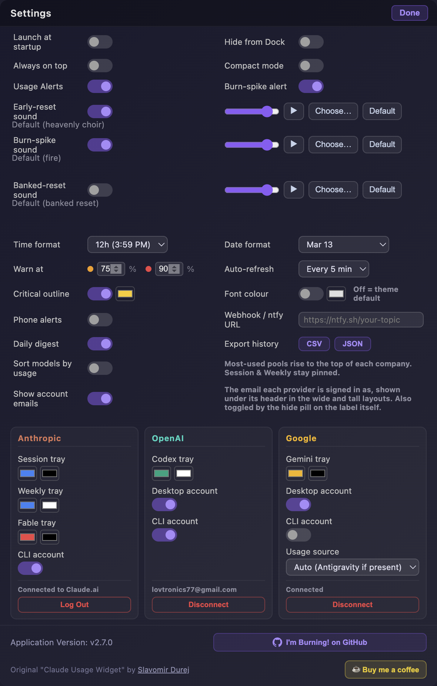
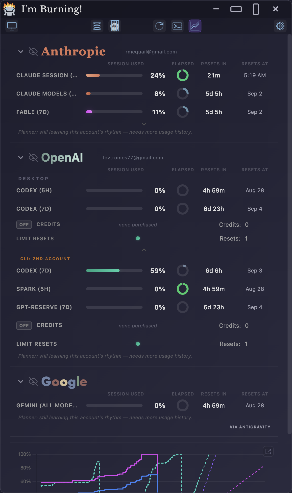

<p align="center">
  
</p>

<h1 align="center">I'm Burning! (Electron)</h1>

**I'm Burning!** — a standalone desktop widget for **Windows, macOS, and Linux** tracking your AI usage across **Anthropic, OpenAI, and Google** in real-time. *Some tokens just want to watch the world learn.*

> Formerly **Burnwatch**. Based on [Claude Usage Widget](https://github.com/SlavomirDurej) © Slavomir Durej (MIT). The internal package name stays `claude-usage-widget` so upgrades keep your settings.

> **Two builds, one widget.** This is the **Electron** build. A native-webview port, [**I'm Burning! (Tauri)**](https://github.com/dev-newb/imburning-tauri), runs the *same renderer* behind a Rust backend — a ~10 MB binary using the OS webview instead of a bundled Chromium. Feature parity is tracked commit-for-commit; pick whichever runtime you prefer.



---

## New in 2.7 — the rename, the sounds, and the smoke

- 🤖 **New name, new face** — the app is now *I'm Burning!*, with the burning pixel robot as its icon in the Dock, Cmd-Tab switcher, and Finder.
- 🎵 **Alert sounds** — a limit clearing **early** (an OpenAI banked/immediate reset, or the Anthropic equivalent) plays a heavenly choir; a **burn-spike** plays fire. Each sound has its own toggle, volume, and a **file picker** to use any audio of your own (Settings).
- ⚫ **Maxed-out bars go dark** — a pool at 100% chars black with a glowing ember edge and **pixel smoke drifting off it**. The fire has been and gone; a spent bar never wears live flames.
- 🔮 **Reset orbs with urgency** — each banked OpenAI limit-reset is its own orb with its own flame: teal while there's runway, **amber inside a week, red inside 24 hours**, with per-orb expiry popups when OpenAI reports them (read via the Codex CLI's app-server).

  

- 🧰 **Toolbar rework** — a slinky for compact mode (it compresses when the widget does), a terminal-prompt icon for CLI-login refresh, a real toothed gear for Settings, and one optically-centred layout in every mode.
- 🧭 **Honest data only** — if a live fetch hiccups, the widget shows its last good data or says it's disconnected; it will never present an old session-log snapshot as current usage.

### And since then

- 📧 **Account emails under every header** — each provider section names the account it's tracking (signed-in or harvested from your CLI logins), hideable in Settings.
- 🎵 **A third sound** — a banked OpenAI reset *landing* gets its own distinct alert, separate from a limit clearing early.
- 🔮 **Orbs everywhere** — the banked-reset orb now renders in every layout, including the wide dual-table where it used to be a bare count.
- 📐 **Layout polish** — symmetric edge padding, credit/reset pairs centred on their column midline, and every column aligned to its header in all three layouts.

---

## The headline: every account on your machine, tracked

Power users end up logged into the **desktop app and the CLI with different accounts** — claude.ai in the browser but another account in the `claude` CLI, ChatGPT desktop plus a second account in `codex`, a Google login here and a different one in `gemini`. Every one of those accounts has its **own limits**, and most trackers only see one of them.

I'm Burning! tracks **both accounts per company, simultaneously**:

- 🔑 **Sign in with ChatGPT / Google** (official OAuth), or let it read your **CLI logins** — no extra setup, strictly read-only
- 🧬 **Same account everywhere?** The views merge automatically — no duplicate rows
- 🟠 **Different accounts?** An amber **CLI: 2ND ACCT** pill appears and the second account gets its own rows, history series, burn-spike alerts, and tray badge
- 🖥️ In **wide mode** the two accounts sit **side by side** — one shared model column, a Desktop cluster and a CLI cluster
- 🖥️ **No web login? No problem.** Signed into the `claude` CLI but not claude.ai? The whole Anthropic section runs straight off that CLI login (*via CLI login*). Google sign-in uses the gemini-cli's public OAuth client, so having `gemini` installed is all it takes.
- 🔥 Not interested? **Burn the pill away** — pixel fire chars it and the rows roll up until you burn it back



---

## Every pool, all three companies

Each provider meters more than one thing — I'm Burning! shows **all of it**:

- **Anthropic** — Claude Session (5h), All Claude Models (7d), **Fable (7d)** plus per-model/surface weekly pools when your account has them (Sonnet, Opus, Cowork, Design, OAuth Apps) and any future model-scoped limit, Extra Usage spend, and prepaid Account Credits
- **OpenAI** — Codex (7d), the separate **GPT-5.3-Codex-Spark** pool, Code Review (when your account has one), purchased credits, and banked **limit-reset orbs** with per-orb expiry
- **Google** — one row per model **version** (2.5 Pro, 2.5 Flash, 2.5 Flash Lite, 3.1 Flash Lite…), because Google meters each separately, in progressive shades of Google blue

Don't care about a pool? **Hover it and click the minus** — the row **burns away to nothing** and the window smoothly closes the gap. Bring it back from the *N hidden* chip and it fades in under a shower of gold sparkles.

---

## A layout for every window

The widget **reflows in realtime** as you drag — no fixed layouts, no clipped text:

- 📏 **Live resize ladder** — full labels → abbreviated → colour-coded chips (`CLA 5H · CDX · SPK · 2.5P`) → countdown text becomes **remaining-time pies** → redundant columns bow out — down to a 200px sliver
- 🖼️ **Orientation aware** — wider than tall? The three companies line up as **columns** with per-column headers and the chart spanning below
- 🖥️↕️ **Wide / Tall presets** — two title-bar buttons snap the window into the landscape three-column layout or a tall stacked view sized to its content, then toggle back to the auto-sized widget
- 🗜️ **Compact mode** (the slinky button — it compresses when the widget does) — one slim bar per pool across all companies, grouped by company colour, fits any corner:

  <p align="center">
    
    
  </p>

- 🪟 **Windows Snap** works natively — drag to an edge or Win+Arrow
- ↕️ The window **grows and contracts with its content**: toggle the graph, burn a group away, hide a tracker — the frame follows

---

## Make it yours

- 🎨 **Themes** — Dark, Light, or follow the System (the toolbar button cycles moon → sun → monitor), plus a custom widget **font colour**

  

- 🎵 **Alert sounds** — per-sound enable, volume, preview, and *Choose…* to swap in any audio file you like; *Default* brings the bundled ones back
- 🖌️ **Tray badge colours** — per-company background + number colours, with an optional **critical outline** when a provider flags a limit
- ⏱️ **Refresh interval** — 15s to 5m (default 5m); countdowns tick live in between
- 📌 **Window behaviour** — launch at startup, always-on-top, hide-from-taskbar/Dock, remembered position
- 🧯 **Thresholds** — set your own warn/danger percentages that recolour every bar



---

## Watching the burn

⏳ **Burn-rate Forecast** — projects when each pool hits 100%, on the chart and in tooltips, for every provider and second account
🗓️ **Session Planner** — per-company: finds your heaviest hours and suggests when to start a fresh window
🔥 **Burn-spike detection** — median+MAD anomaly detection on every tracked series; a pool eating tokens unusually fast catches **live pixel fire in its own colour** until the pace settles. Click a burning bar to switch between **Classic pixel** and **Particle inferno** flame styles
⚫ **Maxed-out treatment** — at 100% the bar goes black and **smoulders with pixel smoke** until the window resets
🔔 **Usage & burn-spike alerts** — desktop notifications, plus the fire sound if you keep it on
🎺 **Early-reset fanfare** — when a limit clears *before* its scheduled time (banked reset spent, provider grace), the choir sings. Resets are rare and glorious; the acknowledgment matches.
📱 **Phone alerts** — ntfy/webhook push for spikes, danger levels, maxed pools, daily digest
📈 **The Prediction Graph** — 7-day history with dotted projections, cross-provider comparison on one 0–100% axis, clickable legend, and a pop-out always-on-top window
💾 **History export** — full usage history to **CSV or JSON**, a local file save, nothing uploaded

---

## The fun parts

🔥 **Pixel fire** — hiding an account group sends a flame across its heading, charring the letters with sparks and smoke; reversing heals it letter by letter
✨ **Reset sparkles** — when a limit window completes, its ring gets a wand-tap burst
🧊 **On ice** — companies you haven't touched in days freeze over, icicles and all
🔮 **Magic orbs** — banked OpenAI limit-resets glimmer, each with its own small flame
🤡 **The clown** — click him and he goes to jail, sad and crying, and every animation, glow, and filter goes still. For the resource-conscious and the joyless alike:



---

## Installation

### macOS (build from source — the supported path)

One paste. It installs anything missing (git, Node via Homebrew), clones, builds the newest release tag, installs **I'm Burning!.app** to /Applications, launches it, and registers an auto-updater that rebuilds on every future release:

```bash
git clone https://github.com/dev-newb/imburning-electron.git ~/imburning && cd ~/imburning && bash tools/mac/install.sh
```

- **Requirements:** Node 18+ in `/opt/homebrew/bin` or `/usr/local/bin` (`brew install node`), git. No Xcode needed.
- **No Gatekeeper prompt** — a locally built app carries no quarantine flag, so there is nothing to bypass and no `xattr` incantation.
- **Don't move the clone** — the background updater (login + every 6h) rebuilds from it.
- Watch a build: `tail -f ~/Library/Logs/burnwatch-update.log`

### Windows

1. Download the latest `ImBurning-{version}-win-Setup.exe` (installer, silent auto-update) or `ImBurning-{version}-win-portable.exe` from [Releases](../../releases)
2. Run it. **Portable autostart:** `Win+R` → `shell:startup` → drop the exe in.

### Linux

Download `ImBurning-{version}-linux-{arch}.AppImage` from [Releases](../../releases) (Ubuntu 22.04+ may need `sudo apt install libfuse2`), or build with `npm run build:linux`.

<details>
<summary>Desktop launcher & autostart (optional)</summary>

```bash
mkdir -p ~/.local/bin
mv ImBurning-*.AppImage ~/.local/bin/imburning.AppImage
chmod +x ~/.local/bin/imburning.AppImage

cat > ~/.local/share/applications/imburning.desktop << EOF
[Desktop Entry]
Name=I'm Burning!
Comment=Track AI usage across Anthropic, OpenAI and Google
Exec=$HOME/.local/bin/imburning.AppImage --no-sandbox
Icon=$HOME/.local/bin/imburning.AppImage
Terminal=false
Type=Application
Categories=Utility;
StartupNotify=true
EOF

update-desktop-database ~/.local/share/applications/
# autostart at login:
mkdir -p ~/.config/autostart
cp ~/.local/share/applications/imburning.desktop ~/.config/autostart/
```
</details>

### Build from source (any platform)

```bash
git clone https://github.com/dev-newb/imburning-electron.git
cd imburning
npm install
npm start          # or: npm run build:mac / build:win / build:linux
```

---

## Privacy

Your tokens stay on your machine. The widget talks only to the providers' own APIs (claude.ai, chatgpt.com, Google) with credentials you supplied or that your CLIs already hold — CLI credential files are read **read-only**, never modified, never transmitted anywhere else. Diagnostics never print key material. History export is a local file save.

---

## License

MIT © 2026 dev-newb · based on **Claude Usage Widget** © Slavomir Durej (MIT)
